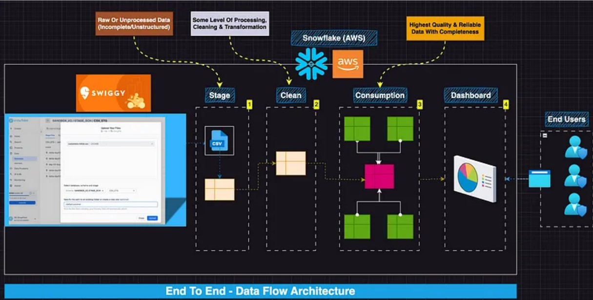

# Snowflake Food Aggregator Data Pipeline project

## Overview

This project demonstrates how food aggregators and quick-commerce platforms leverage Snowflake, which operates on AWS Cloud, to manage their data pipelines efficiently. The tutorial walks through the complete process, from ingesting raw order data to transforming it into a structured data warehouse using a three-layer architecture.

We explore the journey of data through Snowflake—from staging to cleaning and finally to consumption—where it is optimized for analytics. The project also includes a Streamlit-based interactive dashboard that provides key business insights, such as revenue trends, order metrics, and customer behavior. Whether you're a beginner or looking for a hands-on Snowflake data engineering experience, this project provides a step-by-step guide to building a scalable ETL/ELT pipeline.

## Architecture

1. **Data Ingestion**: Data is loaded into Snowflake's stage location.
2. **Staging Layer**: Data is copied from the stage to a raw table using Snowflake's Snowsight and COPY command.
3. **Clean Layer**: Basic transformations and cleaning are performed before moving data here.
4. **Consumption Layer**: Fact and dimension tables are created in a Star Schema format.
5. **Dashboarding**: A Streamlit app fetches insights like total revenue, average revenue per order, total orders, and monthly revenue trends.

## Entities Considered

- Location
- Restaurant
- Customer
- Customer Address
- Login Audit
- Menu
- Orders
- Order Items
- Delivery Agent
- Delivery

## Key Features

- **Data Loading**: Utilizes Snowsight's file loading for easy ingestion.
- **Delta Data Handling**: Supports incremental data loads.
- **Query Optimization**: Uses `$` notation and COPY commands for efficiency.
- **Transformation Pipeline**: Implements the Merge statement to transition data across layers.
- **OLTP to OLAP Conversion**: Converts a normalized 3NF schema to a Star Schema for analytics.
- **Streamlit Dashboard**: Provides business insights with KPIs and trends.
